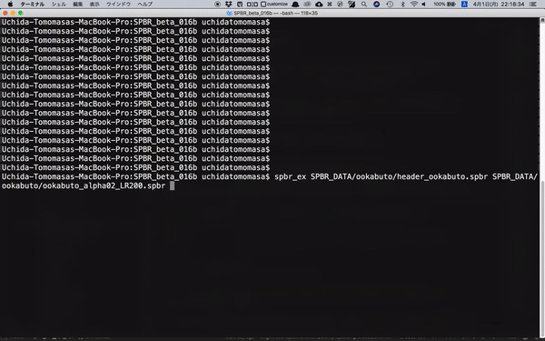

# SPBR_beta_016b

## Overview
- An extended version of SPBR
- Implemented "#/BrightnessAdjustment" command

## Prerequisites
- KVS: 2.7.0
- SPBR: beta_016b

## New Command
```
#/BrightnessAdjustment 1 or 0 (default: 0)
```

## Usage
```bash
$ spbr_ex input.spbr
```

or

```bash
$ spbr_ex input.ply
```

## Demo movie
